# 🏥 Hospital Management System

A **console-based Hospital Management System** developed in **C++** using Object-Oriented Programming (OOP) principles and various C++ programming concepts.

The system is designed to manage hospital operations through different user roles, including Patients, Doctors, Admins, and a Manager. It covers appointment management, medical records, payments, bank accounts, financial transactions, and hospital financial management.

---

## 👥 User Roles

The system is based on four main user roles:

* 💼 Manager
* 👨‍💼 Admin
* 👨‍⚕️ Doctor
* 👤 Patient

Each role has specific responsibilities and permissions.

---

### 💼 Manager

The **Manager** is responsible for **Admin Management and the hospital's financial operations**.

The Manager can access:

#### 👥 Admin Management

- Add admins
- Remove admins
- Update admin information

#### 🏦 Hospital Account

- View the hospital account
- View the hospital balance

#### 💰 Payroll

- Pay doctors' salaries
- Pay admins' salaries
- Transfer doctors' consultation shares

#### 📊 Reports

- View transaction history
- View financial summaries
- Manage and review doctors' financial entitlements

The Manager handles the hospital's financial operations through the **Manager Management** component.

The Manager uses the **Doctor ID** to identify the doctor when transferring the doctor's consultation share.

---

### 👨‍💼 Admin

The **Admin** is responsible for the hospital's **day-to-day operational management**.

The Admin can access:

#### 👥 Patient Management

- Register new patients
- Manage patient-related operations

#### 👨‍⚕️ Doctor Management

- Add doctors
- Update doctors
- Remove doctors

#### 📅 Appointment Management

- Manage appointments

#### 💳 Payment Management

- View pending cash payments
- Confirm cash payments

The Admin also has a personal bank account and can access their account information.

---

### 👨‍⚕️ Doctor

The **Doctor** can access:

#### 📅 Appointment Management

- View their appointments
- Manage their appointments

#### 🩺 Medical Records

- Create medical records for their patients
- Add diagnosis
- Add prescriptions
- Add medical notes

#### 🏦 Account

- View their account information
- Manage their personal bank account

---

### 👤 Patient

The **Patient** can access:

#### 📅 Appointments

- Book appointments
- View their appointments
- Cancel appointments

#### 🩺 Medical Records

- View their medical records

#### 🏦 Account

- View their account information
- View their bank account and balance
- Pay consultation fees
- Choose between Cash and Visa payment methods

---

# 🏦 Banking System

The system manages **independent bank accounts** for the main users and entities:

```text
┌─────────────────┐
│ Patient Account │
└─────────────────┘

┌─────────────────┐
│ Doctor Account  │
└─────────────────┘

┌─────────────────┐
│  Admin Account  │
└─────────────────┘

┌──────────────────┐
│ Hospital Account │
└──────────────────┘

```

Each bank account contains:

🔢 Account Number
💰 Balance

These accounts are used throughout the system to perform financial operations such as:

💳 Payments
💵 Salary payments
↩️ Refunds
🔄 Financial transfers

The banking system allows financial operations to be performed between the different accounts while maintaining the current balance of each account.

---

# 🧾 Transaction Logging

The system maintains a persistent **Transaction History** for financial operations.

Every completed financial transaction is recorded in a dedicated transaction file, allowing the system to keep a historical record of financial activities.

Each transaction stores:

* Sender
* Receiver
* Amount
* Transaction Type
* Date and Time

### 📝 Transaction Format

```text
Sender-Receiver-Amount-Transaction Type-Date & Time
```

### 📌 Example

```text
PAT1004-HOS-400-Appointment Payment-05/08/2026 04:56:59
PAT1004-HOS-400-Appointment Payment-05/08/2026 05:06:53
HOS-ADM1004-7000-Admin Salary-05/08/2026 06:24:56
HOS-PAT1004-400-Refund-05/08/2026 06:29:23
HOS-DOC1012-240-Doctor Entitlement-05/08/2026 17:28:40
Reception-HOS-400-Appointment Payment-23/08/2026 03:43:58
```

The transaction history can contain different types of financial operations, including:

* 💳 Appointment Payments
* ↩️ Refunds
* 💰 Doctor Entitlements
* 💵 Doctor Salary Payments
* 💵 Admin Salary Payments
* 🔄 Money Transfers

This provides a clear **financial audit trail** and allows the system to track financial activities over time.

---

# 💳 Payment System

Patients can pay their consultation fees using:

* 💵 Cash
* 💳 Visa


### 💵 Cash Payment

When a patient chooses Cash, the payment is initially registered as a **pending cash payment**.

The Admin can then access the Payment Management section to:

* View pending cash payments
* Confirm cash payments

Once the cash payment is confirmed, the payment is processed by the system and recorded as a financial transaction.

### 💳 Visa Payment

For Visa payments, the system checks whether the patient has sufficient balance before processing the payment.

The consultation payment is then transferred to the **Hospital Account** and recorded in the transaction history.

The doctor's share is handled separately through the financial management system.

---

# 💰 Doctor Consultation Share

For each consultation, the doctor is entitled to **30% of the consultation fee**.

The doctor's 30% is **not transferred directly to the doctor when the patient pays**.

Instead, the financial flow is:

```text
Patient
   │
   │ Consultation Payment
   ▼
Hospital Account
   │
   │ Doctor's 30% becomes an entitlement
   ▼
Doctor Financial Entitlement
   │
   │ Manager performs transfer
   │ using Doctor ID
   ▼
Doctor Bank Account
```

### 📌 Example

If the consultation fee is:

```text
1000
```

The doctor's entitlement is:

```text
30% = 300
```

The hospital initially receives the full:

```text
1000
```

The `300` becomes an amount owed to the doctor.

Later, the **Manager** can transfer the doctor's entitlement to the doctor's bank account using the doctor's ID.

---

# 🔄 Financial Transaction Flow

The financial workflow can be summarized as:

```text
Patient
   │
   │ Pay Consultation Fee
   ▼
Hospital Bank Account
   │
   ├───────────────┐
   │               │
   │               ▼
   │        Doctor Entitlement
   │               │
   │               │ Manager
   │               │ uses Doctor ID
   │               ▼
   │        Doctor Bank Account
   │
   ▼
Hospital Balance
```

This design separates **receiving the patient's payment** from **transferring the doctor's financial share**.

All completed financial operations are also stored in the transaction history file.

---

# 🏦 Accounts in the System

The system manages bank accounts for:

| Account          | Purpose                                                 |
| ---------------- | ------------------------------------------------------- |
| Patient Account  | Stores the patient's available balance                  |
| Doctor Account   | Receives salaries and consultation shares               |
| Admin Account    | Receives admin salary                                   |
| Hospital Account | Receives patient payments and manages hospital finances |

Each account has an account number and balance.

---

# 📊 Financial Reporting

The transaction history is used as a source of financial information and reporting.

The system keeps a persistent record of financial activities, allowing the Manager to monitor transactions and review the hospital's financial operations.

Financial information can include:

* 🧾 Hospital transactions
* 📅 Appointment payments
* ↩️ Refunds
* 💰 Salary payments
* 👨‍⚕️ Doctor entitlements
* 🔄 Money transfers

This allows the system to maintain a clear financial history rather than relying only on current account balances.

---

# 📅 Appointment Management

The appointment system allows patients to:

* 📅 Book appointments
* 👁️ View appointments
* ❌ Cancel appointments

The system also checks:

* 👨‍⚕️ Doctor availability
* 👤 Patient availability
* 📌 Appointment status

Appointments have their own IDs and statuses such as:

```text
Scheduled
Completed
Cancelled

---

# 🩺 Medical Records

Doctors can create medical records associated with a specific appointment.

A medical record contains:

* 👤 Patient ID
* 👨‍⚕️ Doctor ID
* 📅 Appointment ID
* 🩺 Diagnosis
* 💊 Prescription
* 📝 Notes

Before creating a medical record, the system verifies that the doctor is actually associated with the appointment and that the appointment has not been cancelled.

---

# 💼 Management Responsibilities

The system separates operational management from financial management.

The **Admin** handles the hospital's operational tasks, including:

* 👤 Registering patients
* 👨‍⚕️ Managing doctors
* 📅 Managing appointments
* 💵 Confirming cash payments

The **Manager** is responsible for:

* 👨‍💼 Managing admins
* 🏦 Hospital account management
* 💰 Payroll
* 🔄 Financial transfers
* 👨‍⚕️ Doctor consultation shares
* 📊 Financial reports

This separation of responsibilities helps keep the system organized and clearly defines the responsibilities of each role.

---

# 🧠 Programming Concepts Used

This project applies several important **C++ programming concepts**, including:

- 🧩 Object-Oriented Programming (OOP)
- 🔒 Encapsulation
- 🌳 Inheritance
- 🔄 Polymorphism
- 🏗️ Constructors
- 📋 Copy Constructors
- ⚙️ Static Members
- ➕ Operator Overloading
- 🧰 Templates
- ⚠️ Exception Handling
- 📁 File Handling
- 💾 Dynamic Memory
- 📦 STL Containers
- 🗂️ Data Structures
- 🛡️ Input Validation

---

### 🗄️ HospitalData

`HospitalData` is the central data class responsible for storing the hospital's main system data in memory.

It maintains the main data collections and financial information used throughout the system, including:

- 👤 Patients
- 👨‍⚕️ Doctors
- 👨‍💼 Admins
- 📅 Appointments
- 🩺 Medical Records
- 🏦 Bank Accounts
- 🏥 Hospital Account
- 💸 Financial Transactions
- 💰 Financial Entitlements

The different managers and system components use `HospitalData` to access and update the current hospital data.

Persistent data is stored in files and loaded into `HospitalData` when the application starts. Changes made during execution are written back to the corresponding files to maintain data persistence.

---


# 💾 Data Persistence

The system uses **file-based storage** to preserve data between program executions.

The application stores and restores information such as:

- 👤 Patients
- 👨‍⚕️ Doctors
- 👨‍💼 Admins
- 📅 Appointments
- 🩺 Medical Records
- 🏦 Bank Accounts
- 🏥 Hospital Account
- 💰 Financial Entitlements
- 💸 Transactions
- 🆔 IDs

This allows the system to restore its data when it is started again.

---

# 🛡️ Validation & Data Integrity

The system includes validation and checks to prevent invalid operations.

Examples include:

* 👨‍⚕️ Checking doctor availability
* 👤 Checking patient availability
* 📅 Preventing invalid appointments
* 📌 Checking appointment status
* 👨‍⚕️ Verifying the doctor associated with an appointment
* 💳 Checking sufficient patient balance for Visa payments
* 🏦 Validating account balances
* 👤 Validating user information
* 💰 Handling invalid financial operations
* 🛡️ Preventing invalid data from being stored

---

# 🏗️ Project Structure

The system is organized into different components, with each class responsible for a specific part of the application.

```text
Hospital Management System
│
├── Users
│   ├── Patient
│   ├── Doctor
│   └── Admin
│
├── Management
│   ├── PatientManager
│   ├── DoctorManager
│   ├── AdminManager
│   └── Manager
│
├── Appointments
│   ├── Appointment
│   └── AppointmentManager
│
├── Medical Records
│   ├── MedicalRecord
│   └── MedicalRecordManager
│
├── Banking & Finance
│   ├── BankAccount
│   ├── Payment Management
│   ├── Transaction Management
│   └── Financial Entitlements
│
├── Data Management
│   ├── HospitalData
│   ├── FilesHelper
│   ├── FileManager
│   └── Parser
│
└── Utilities
    ├── Validation
    ├── DataEntry
    └── Console
```

---

# 🛠️ Technologies

| Technology              | Usage                          |
| ----------------------- | ------------------------------ |
| **C++**                 | Main programming language      |
| **OOP**                 | Application architecture       |
| **STL**                 | Data structures and containers |
| **File I/O**            | Data persistence               |
| **Exception Handling**  | Error management               |
| **Windows Console API** | Console interface              |
| **Visual Studio**       | Development environment        |

---

# ▶️ How to Run

## ⚙️ Requirements

* Windows
* Visual Studio 2022 or later
* C++ compiler
* C++17 or later recommended

## ▶️ Running the Project

1. Clone the repository:

```bash
git clone https://github.com/ahmedreda472003/Hospital-Management-System.git
```

2. Open the project in **Visual Studio**.

3. Select the appropriate configuration:

```text
Debug / Release
x64
```

4. Build the solution:

```text
Build → Build Solution
```

5. Run the application:

```text
Debug → Start Without Debugging
```

---


بده:
# 📷 Screenshots

### 🏥 Welcome Screen

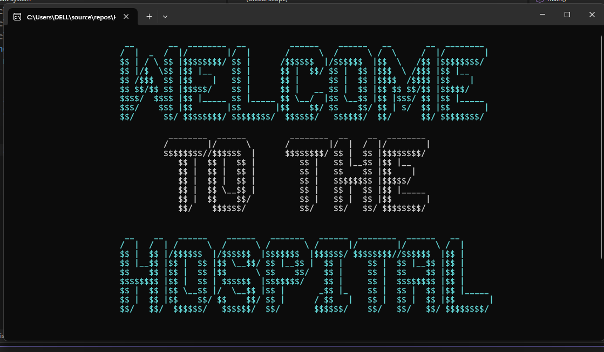

### 🔐 Login Screen 1

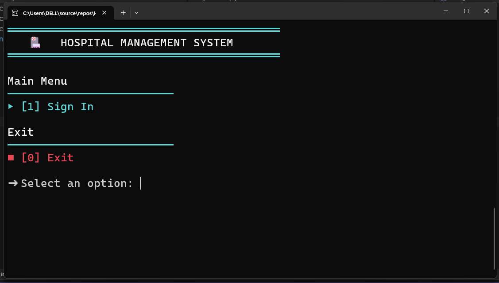

### 🔐 Login Screen 2

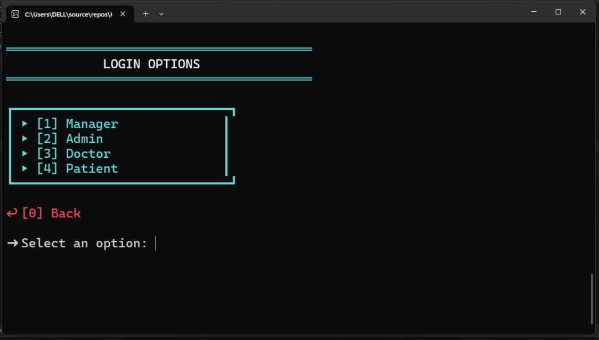

### 💼 Manager Panel

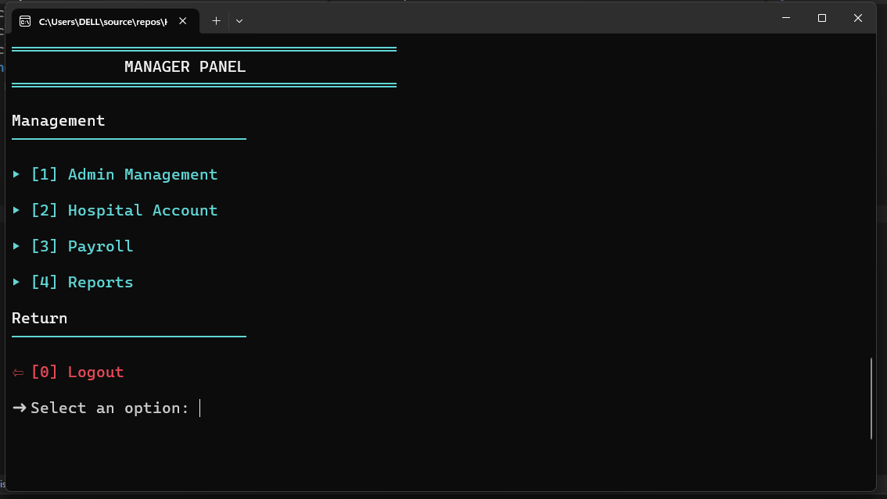

### 👤 Patient Menu

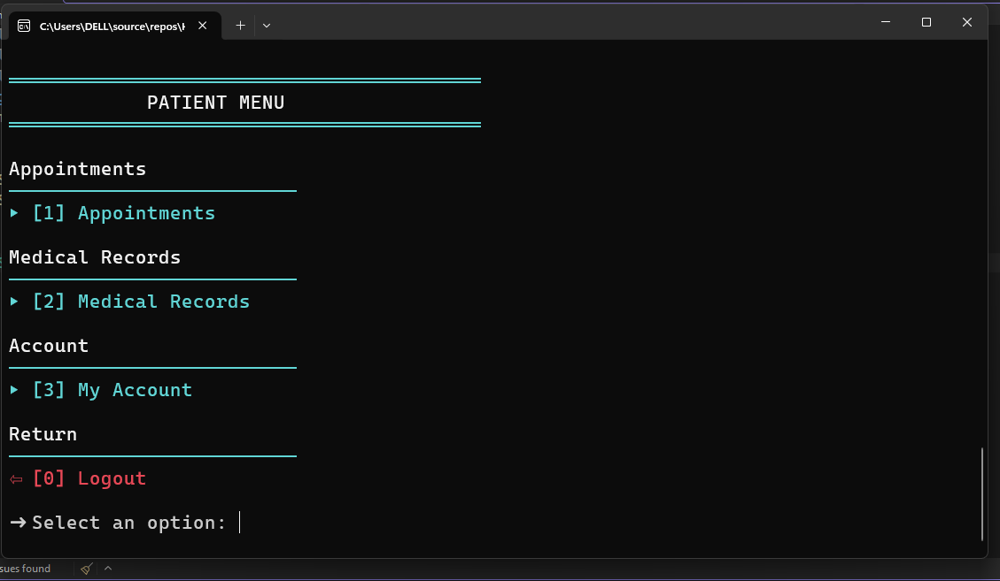

### 👨‍⚕️ Doctor Menu

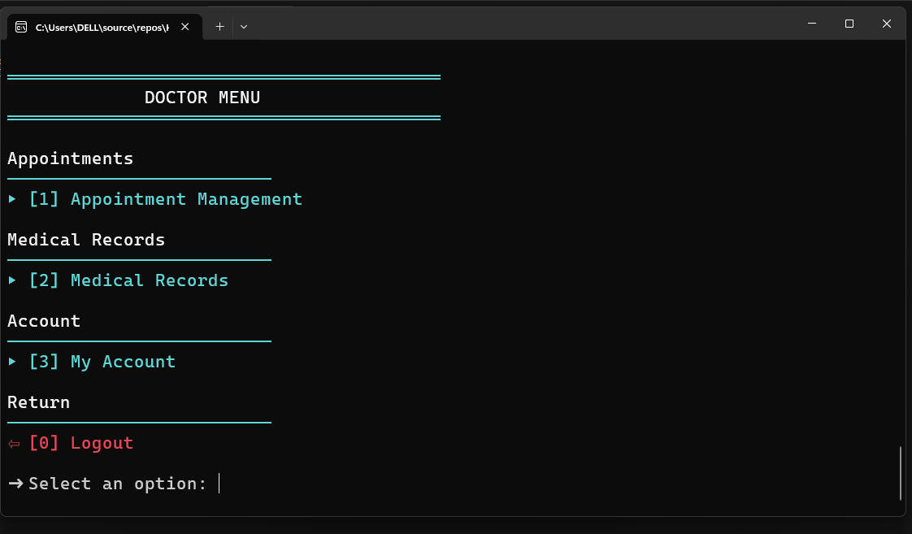

### 👨‍💼 Admin Menu

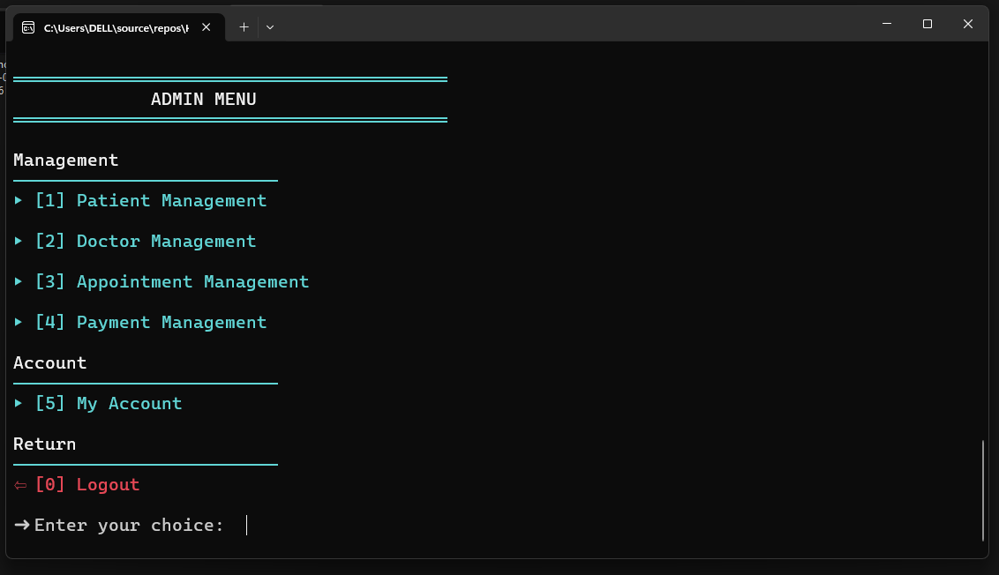

### 📅 Appointment Management

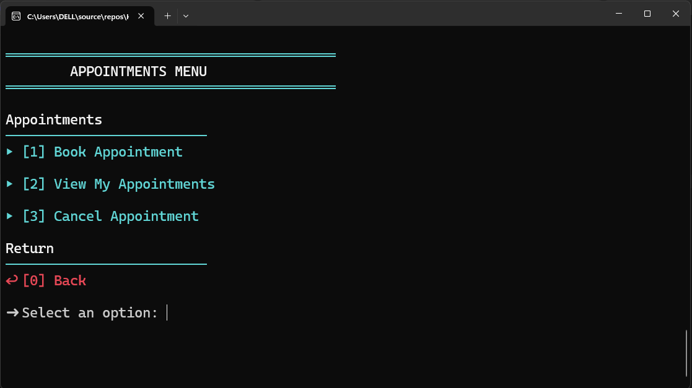

### 🩺 Medical Records

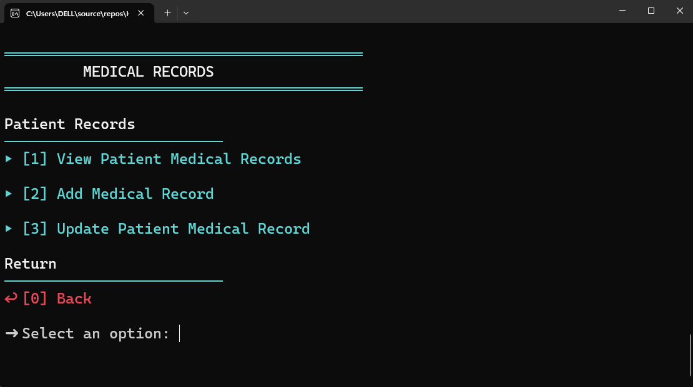

### 🏦 Hospital Account

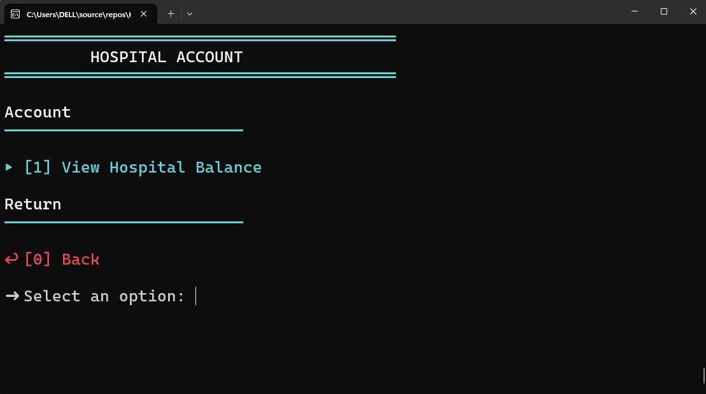

### 💰 Payroll

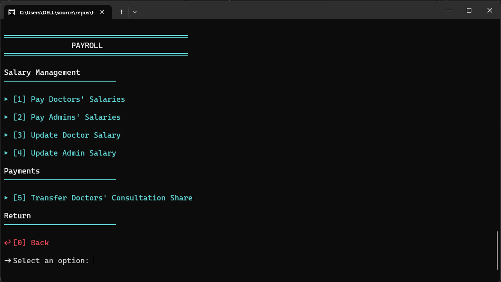

### 📊 Reports

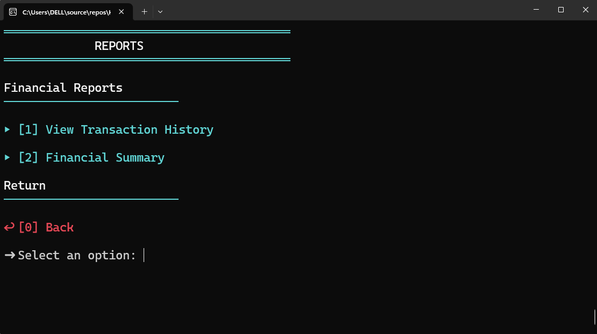


# 🎯 Project Goals

The main goals of this project were to:

* Build a complete real-world C++ console application.
* Apply Object-Oriented Programming concepts in a practical project.
* Design a multi-role management system.
* Implement relationships between different system entities.
* Practice file-based data persistence.
* Apply data structures to real-world problems.
* Implement validation and exception handling.
* Design a banking and financial transaction system.
* Implement persistent transaction logging.
* Separate operational and financial responsibilities.

---

# 👨‍💻 Author

**Ahmed Reda**

Aspiring Software Developer focused on:

* C++
* Object-Oriented Programming
* Data Structures
* Problem Solving
* Software Development

---

## ⭐ Support

If you find this project useful or interesting, consider giving the repository a ⭐ on GitHub.

---

## 📄 License

This project is intended for educational and portfolio purposes.


